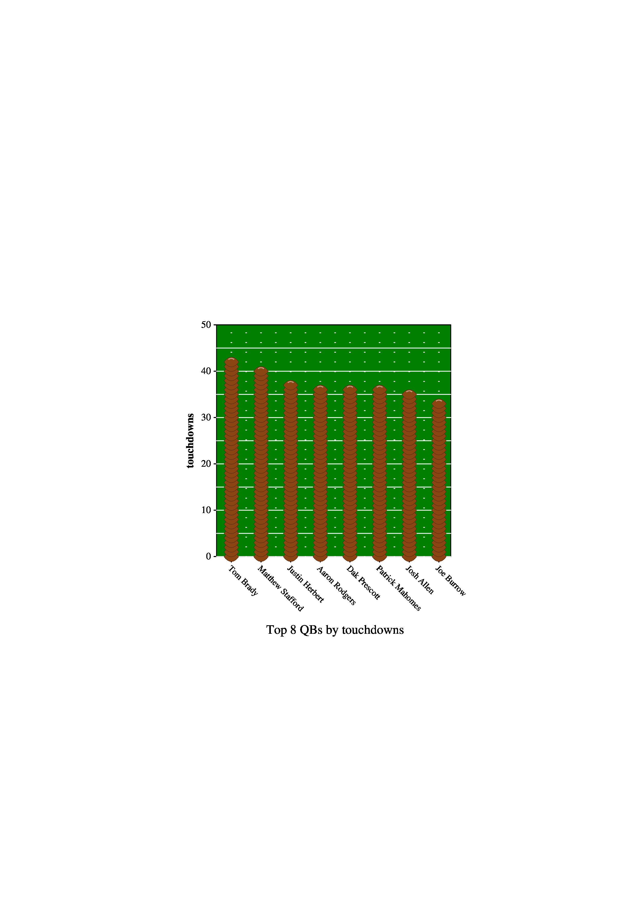

# QB-Stat-Grapher
By Noah Shoap

For [CS494 Lab1](http://web.eecs.utk.edu/~jplank/plank/classes/cs494/494/labs/Lab-1-Jgraph/).

## About
This program reads in a .csv file from the website [ProFootballReference](https://www.pro-football-reference.com/years/).

It reads the file into Quarterback objects, and then uses the command-line arguments to determine how the QBs are sorted.

The program is called by:
```./bin/qb-stat-grapher input.csv output.jgr top|bottom stat number```

For instance, the following command:
```./bin/qb-stat-grapher 2021.csv test.jgr top touchdowns 4```
Generates a jgraph of the top 4 QBs sorted by touchdown passes.

In theory, all stats should be sortable and be able to generate a graph -- some of them look ugly / don't really work well.
The files in the ```sample_images``` directory will stick to stats that look okay when graphed,
and the generator I provide will do the same images that are included in the repo.

## Usage / Installation
Pre-reqs:
1. jgraph -- This project assumes you are running this on the lab machines, as that's how I ran jgraph.  The jgraph executable Dr. Plank provides for the lab machines is in this directory.
1. ps2pdf and convert are installed.

Firstly, clone the repo.
```git clone git@github.com:nshoap-utk/QB-Stat-Grapher.git``` (or ```git clone https://github.com/nshoap-utk/QB-Stat-Grapher.git``` for HTTPS)

Secondly, once in the repo directory, build the executable.
```make clean && make all```

Thirdly, run the generation to generate the .jpg files.
Feel free to play around with the executable's command-line args yourself, but not all stats are probably going to graph well so keep that in mind.

## Credit
This was inspired (and referenced) Dr. Plank's [Jgraph lecture notes](http://web.eecs.utk.edu/~jplank/plank/classes/cs494/494/notes/Jgraph/lecture.html).
I use his football drawing and referenced his football field graph to create this.

I also initially got the idea to do something football related after seeing what Jonathan Ting did, so here is his [write-up](http://web.eecs.utk.edu/~jplank/plank/classes/cs494/494/labs/Lab-1-Jgraph/Ting/index.html) as well.

## Examples
```./bin/qb-stat-grapher 2021.csv tmp.jgr top touchdowns 8```
generates the following jpg:
